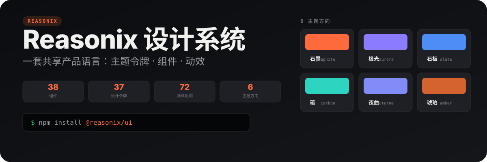
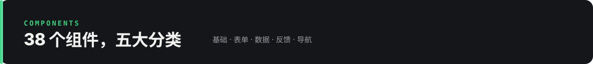

<p align="center">
  
</p>

---

一套共享产品语言：**主题令牌、组件与动效**的开箱即用集合。38 个 shadcn 风格 React 组件，6 个主题方向 × 明暗双态，配完整设计规范与可发布工程。

> 🗺️ **下一阶段路线图**：见 [ROADMAP.md](./ROADMAP.md) — v0.2.0 里程碑：从"组件集合"到"可信赖的设计系统"（测试全覆盖 / 动效纪律 / API 文档 / 令牌审计 / 发布）。

## 为什么选 Reasonix

不只是又一个 shadcn 复制品 —— **设计规范 + 多方向主题 + 动效体系**三位一体：

| | 亮点 |
|---|---|
| 🎨 **多方向主题** | 6 个方向（石墨/极光/石板/碳/夜曲/琥珀）× 明暗，换主题只改 `data-direction` |
| ⚡ **动效体系** | 32 个 keyframes + 28 个 `rx-anim` 工具类，`prefers-reduced-motion` 自动降级 |
| ♿ **无障碍 AA** | 对比度 WCAG AA 审计、键盘可达、focus ring、vitest-axe 测试 |
| 📦 **Tree-shaking** | ESM 构建 + 组件级 subpath exports，按需导入 |
| 📝 **完整类型** | d.ts 随包发布，props 完整类型推断 |
| 🛡️ **工程化** | 72 测试 / 57% 覆盖 / CI+Release 流水线 / changesets 版本管理 |

<p align="center">
  
</p>

## 组件清单

| 分类 | 组件 |
|---|---|
| **基础** | Button · Badge · Card · Skeleton · Separator · Label · Avatar |
| **表单** | Input · Textarea · Checkbox · RadioGroup · Switch · Select · Slider · Toggle · ToggleGroup · InputGroup · Progress |
| **数据** | Table · Calendar · Carousel · ScrollArea · Resizable · Toaster |
| **反馈** | Alert · Dialog · Drawer · Sheet · Command · Popover · HoverCard · Tooltip · DropdownMenu |
| **导航** | Tabs · Accordion · Collapsible · Breadcrumb · Pagination |

<p align="center">
  
</p>

## 快速开始

```bash
npm install @reasonix/ui
# peerDependencies
npm install react react-dom tailwindcss radix-ui vaul sonner cmdk react-day-picker react-resizable-panels embla-carousel-react next-themes
```

```tsx
import { Button, Tabs, TabsList, TabsTrigger, TabsContent } from '@reasonix/ui'
import '@reasonix/ui/styles.css'

function App() {
  return (
    <Tabs defaultValue="tab1">
      <TabsList>
        <TabsTrigger value="tab1">标签一</TabsTrigger>
        <TabsTrigger value="tab2">标签二</TabsTrigger>
      </TabsList>
      <TabsContent value="tab1">内容一</TabsContent>
      <TabsContent value="tab2">内容二</TabsContent>
    </Tabs>
  )
}
```

### 切换主题

```tsx
// 6 个方向：graphite / aurora / slate / carbon / nocturne / amber
document.documentElement.setAttribute('data-direction', 'aurora')
// 明暗
document.documentElement.classList.toggle('dark')
```

## 📦 仓库结构

```
reasonix-design-kit/
├── packages/ui/          → @reasonix/ui 组件库（可发布 npm 包）
├── apps/showcase/        → 展示站源码（React 19 + Tailwind v4）
├── showcase/             → HTML 交付物（双击即开）
│   └── index.html            ★ 可视化文件结构导航（从这里开始）
├── docs/                 → 设计规范（DESIGN.md 9 章）
├── assets/readme/        → README 视觉资产（SVG）
└── .github/workflows/    → CI + Release 流水线
```

## 🖥️ 在线体验

| 入口 | 说明 |
|---|---|
| [showcase/index.html](showcase/index.html) | ★ 文件结构可视化导航 |
| [showcase/reasonix-ui-intro.html](showcase/reasonix-ui-intro.html) | 组件库介绍页 |
| [showcase/reasonix-shadcn-design.html](showcase/reasonix-shadcn-design.html) | 8 页交互展示站（SPA） |
| [showcase/reasonix-components-showcase.html](showcase/reasonix-components-showcase.html) | 97 组件讲解 |
| [docs/DESIGN.md](docs/DESIGN.md) | 设计规范（9 章） |

## 🧑‍💻 开发

```bash
# 组件库
cd packages/ui
npm install && npm test && npm run build

# 展示站
cd apps/showcase
npm install && npm run dev
```

## 📄 License

MIT © 2026 Reasonix Design
